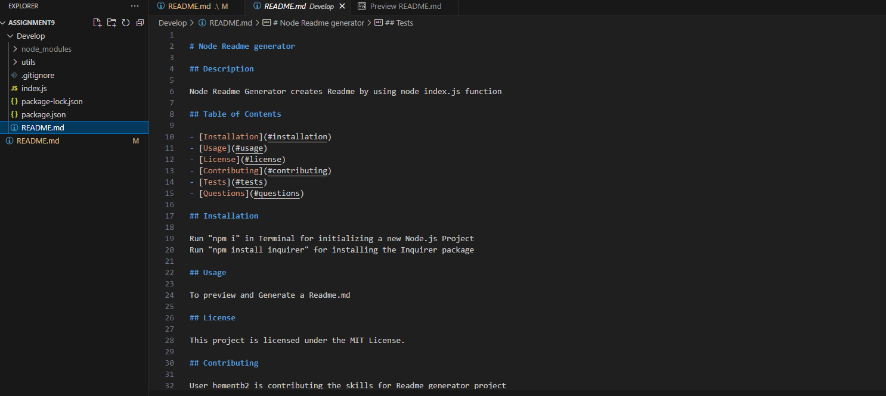
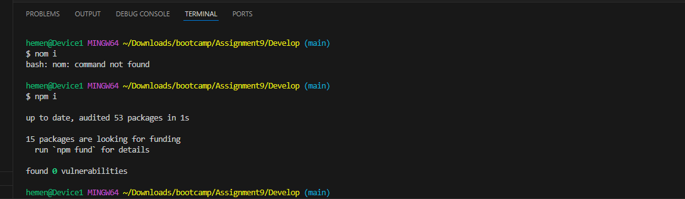
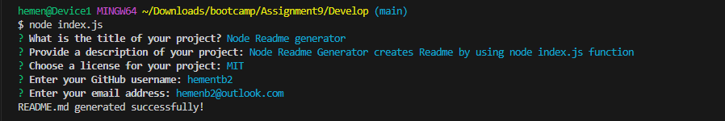

# Professional README Generator

## Description

When creating an open source project on GitHub, it’s important to have a high-quality README for the app. This should include what the app is for, how to use the app, how to install it, how to report issues, and how to make contributions—this last part increases the likelihood that other developers will contribute to the success of the project. You can quickly and easily create a README file by using a command-line application to generate one. This allows the project creator to devote more time to working on the project.

## Table of Contents

- [Installation](#installation)
- [Usage](#usage)
- [License](#license)
- [Contributing](#contributing)
- [Tests](#tests)
- [Questions](#questions)
- [Walkthrough Video](#walkthrough-video)
- [Screenshots](#screenshots)

## Installation

npm install

## Usage
node index.js

Follow the prompts to enter information about your project.

## License
This project is licensed under the MIT License.

## Contributing
Contributions are welcome. Please submit a pull request.

## Tests
npm test

## Questions

If you have any questions, please feel free to contact me:
GitHub: hementb2
Email: hement53@outlook.com

## Walkthrough Video
You can watch a walkthrough video demonstrating the functionality of the README generator  here -https://drive.google.com/file/d/1UhcwNfMinJiDLcKJFAi-NsWaSu1KVTXZ/view?pli=1

## Screenshots

